<div align="center">



<p>
  <a href="https://beastgotfried.vercel.app">
    
  </a>
  <a href="https://www.linkedin.com/in/ankush-wadehra-bb64b0258/">
    
  </a>
  <a href="mailto:wadehraankush@gmail.com">
    
  </a>
</p>

<p>
  
  
</p>

</div>

## The Forge

I build applied AI systems with a product instinct: agent loops, ML-backed dashboards, computer-vision tools, and interfaces that make technical systems usable.

My current center of gravity is **AI agents and applied machine learning**. I like projects where the architecture matters, the behavior can be measured, and the final thing still feels good to use.

```txt
Current quest   agenta, a Python/LangGraph rebuild of AgentGPT
Core craft      AI agents, applied ML, computer vision, product engineering
Builder taste   clear systems, strong visuals, honest metrics, usable interfaces
Chronicles      project notes and writeups at beastgotfried.vercel.app
```

## Relics Worth Opening

<table>
  <tr>
    <td width="50%" valign="top">
      <h3><a href="https://parkalore.vercel.app">Parkalore</a></h3>
      <p><b>Predictive parking-enforcement intelligence console for Bengaluru.</b></p>
      <p>Built for Flipkart GRiD Round 2. It turns a 298k-row traffic-police dataset into forecasts, impact-ranked deployments, repeat-offender workflows, coverage-gap analysis, and curb-planning recommendations.</p>
      <p><b>Why it matters:</b> the system found a 211x evening enforcement blind spot and ranked hotspots by traffic impact, not ticket count.</p>
      <p><code>Next.js</code> <code>Python</code> <code>LightGBM</code> <code>deck.gl</code> <code>MapLibre</code></p>
      <p>
        <a href="https://parkalore.vercel.app"></a>
        <a href="https://github.com/beastgotfried/flipkart-round2"></a>
      </p>
    </td>
    <td width="50%" valign="top">
      <h3><a href="https://github.com/beastgotfried/agenta">agenta</a></h3>
      <p><b>A Python rebuild of the AgentGPT loop using LangGraph and LangChain.</b></p>
      <p>Moves the agent brain from browser-side endpoint calls into one server-side state machine that can plan tasks, choose tools, execute, loop, and summarize results.</p>
      <p><b>Why it matters:</b> structured tool choice, registry-driven tools, tested graph routing, and a clean path toward FastAPI/SSE streaming.</p>
      <p><code>Python</code> <code>LangGraph</code> <code>LangChain</code> <code>Groq</code> <code>FastAPI</code></p>
      <p>
        <a href="https://github.com/beastgotfried/agenta"></a>
      </p>
    </td>
  </tr>
  <tr>
    <td width="50%" valign="top">
      <h3><a href="https://github.com/beastgotfried/rep-implementation">REP Implementation</a></h3>
      <p><b>Reproducible benchmark suite for continual-learning prompting methods.</b></p>
      <p>Implements the REP paper workflow with method folders, shared benchmark code, synthetic smoke tests, frozen ViT adapters, prompt-based continual-learning hooks, checkpoints, and metrics.</p>
      <p><b>Why it matters:</b> a paper-to-code system with reproducible configs, method contracts, accuracy matrices, forgetting metrics, and smokeable experiments.</p>
      <p><code>Python</code> <code>PyTorch</code> <code>Continual Learning</code> <code>ViT</code></p>
      <p>
        <a href="https://github.com/beastgotfried/rep-implementation"></a>
      </p>
    </td>
    <td width="50%" valign="top">
      <h3><a href="https://github.com/beastgotfried/Sign-Language-Detection">Sign Language Recognition</a></h3>
      <p><b>Real-time hand-gesture recognition system.</b></p>
      <p>Captures webcam input, extracts MediaPipe hand landmarks, engineers geometric features, trains a Random Forest classifier, and smooths predictions for live recognition.</p>
      <p><b>Why it matters:</b> dual-hand tracking, confidence thresholds, temporal smoothing, and feature engineering from 21-point hand landmarks.</p>
      <p><code>Python</code> <code>OpenCV</code> <code>MediaPipe</code> <code>scikit-learn</code></p>
      <p>
        <a href="https://github.com/beastgotfried/Sign-Language-Detection"></a>
      </p>
    </td>
  </tr>
</table>

## Chronicles And Side Quests

| Build | What it shows | Stack |
| --- | --- | --- |
| [BEASTED Blog](https://beastgotfried.vercel.app) | Markdown-driven tech writing site with project notes and architecture posts | React, Vite, Markdown, Tailwind |
| [miniagent](https://github.com/beastgotfried/miniagent) | Minimal LangGraph tool-calling loop for learning agent internals | Python, LangGraph, LangChain, Groq |
| [gpt](https://github.com/beastgotfried/gpt) | Character-level transformer implementation from scratch | Python, PyTorch |
| [ZenSpace](https://github.com/beastgotfried/ZenSpace) | Gesture and posture-aware wellness intervention prototype | Python, OpenCV, MediaPipe |
| [text-summariser-langchain](https://github.com/beastgotfried/text-summariser-langchain) | LangChain summarization project and learning track | Python, LangChain, Groq |

## Armory

<p>
  
  
  
  
  
  
  
  
  
  
</p>

```txt
AI and agents       LangGraph, LangChain, Groq, Gemini, tool selection, agent loops
Applied ML          PyTorch, scikit-learn, LightGBM, evaluation, reproducible configs
Vision              OpenCV, MediaPipe, landmarks, real-time webcam pipelines
Product surfaces    React, Next.js, Vite, Tailwind, FastAPI, SQLite, Vercel
Data and maps        pandas, NumPy, Recharts, deck.gl, MapLibre, OpenStreetMap
```

## Current Quest Log

- Build **agenta** into a streamed agent backend with FastAPI, SSE, checkpointing, and durable memory.
- Turn learning projects into clear writeups so each repo explains the architecture, not just the code.
- Keep building AI/ML products where prototype quality, measurable behavior, and visual taste all matter.

## The Ledger

<div align="center">


<br/>


</div>

## Send A Raven

<p>
  <a href="https://www.linkedin.com/in/ankush-wadehra-bb64b0258/">LinkedIn</a> ·
  <a href="https://beastgotfried.vercel.app">Blog</a> ·
  <a href="mailto:wadehraankush@gmail.com">Email</a>
</p>
